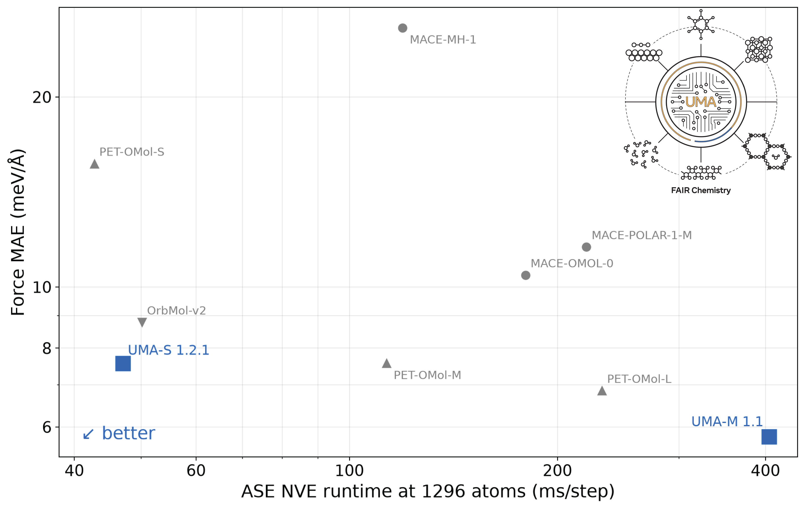

# OMol force accuracy and runtime



This benchmark compares official ASE calculators on molecular force accuracy
and MD throughput. Force MAE is measured on all 2,720,091 unique ωB97M-V
structures in the public OMol25 validation set. Runtime is the mean wall time
of an ASE `VelocityVerlet` NVE step for the included 1,296-atom ice-Ih cell.

The timing runs used one NVIDIA H200 per model. The initial force evaluation
and 200 warm-up steps are excluded. Each result is the mean of the following
100 steps, with CUDA synchronized around every measured step. UMA uses turbo
mode, MACE uses CuEq, and OrbMol-v2 uses its compile option.

MACE-MH-1 only supports neutral singlets, so its accuracy point uses 1,071,880
structures (39.4% of the validation set). Charge and spin multiplicity are
passed to every calculator for every evaluated structure.

Energy MAE benchmarks show similar results. When benchmarking energies, some
care should be taken due to the fact that MACE-MH-1 (OMol head) uses different
energy baselines compared to the other models.

## Reproducing the benchmark

Preferably use a separate environment for each model family. The plotted runs
used Python 3.12, PyTorch 2.13.0, ASE 3.29.0, `fairchem-core==2.22.0`,
`orb-models==0.7.0`, `mace-torch==0.3.16`, and `upet==0.2.7.dev2+g788225b15`.

Download each model from its official release and place the checkpoint in one
directory (by default, `./checkpoints`). The expected filenames are listed in
[`speed.py`](speed.py). UMA is downloaded through the FairChem model registry.

Run one timing case with:

```bash
python benchmarks/omol/speed.py uma_s results/uma_s_speed.json
```

(where you can swap out `uma_s` for other models as well)

For the accuracy benchmark, download the seven `co_*.parquet` files from the
public OMol25 validation release and prepare the ωB97M-V selection once:

```bash
python benchmarks/omol/force_mae.py prepare \
  /path/to/OMol25_validation /path/to/prepared_data
```

The prepared data has 800 shards. A full evaluation may run in one process, or
be divided among independent one-GPU jobs. For example, splitting the workflow
into 200 parts and running part 0 looks like this:

```bash
python benchmarks/omol/force_mae.py run \
  uma_s /path/to/prepared_data results/uma_s_0.json \
  --part 0 --parts 200
```

You will also have to run all parts from 1 to 199 separately.

You should then merge the outputs after all jobs finish:

```bash
python benchmarks/omol/force_mae.py merge \
  results/uma_s.json results/uma_s_*.json
```

Currently, PET requires the corrected nvalchemi neighbor capacity
`ceil(max(128, cutoff**3))`, without a factor of `len(system)`. MACE-POLAR-1-M
requires the nonperiodic reciprocal-grid fix that skips construction of an
unused k-grid when all periodic-boundary flags are false.
