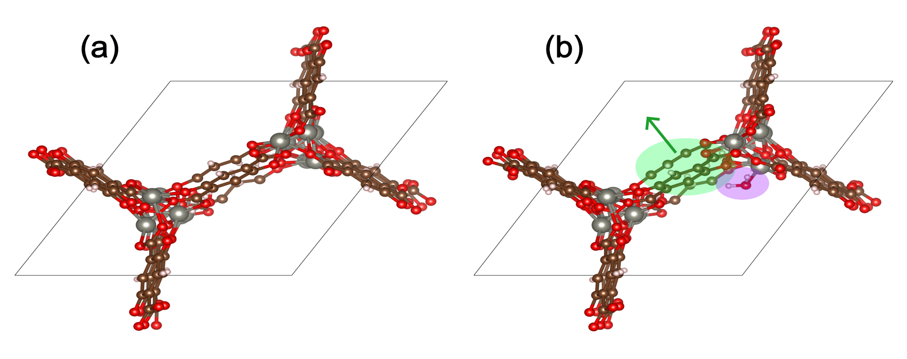

# Adsorption in Flexible MOFs

The adsorption energy calculation method outlined above is typically performed with rigid MOFs for simplicity. Both experimental and modeling literature have shown, however, that MOF flexibility can be important in accurately capturing the underlying chemistry of adsorption [[1]](https://arxiv.org/abs/2506.09256) [[2]](https://pubs.acs.org/doi/10.1021/jacs.7b01688) [[3]](https://www.nature.com/articles/nature15732). In particular, uptake can be improved by treating MOFs as flexible. Two types of MOF flexibility can be considered: intrinsic flexibility and deformation induced by guest molecules. In the Open DAC Project, we consider the latter MOF deformation by allowing the atomic positions of the MOF to relax during geometry optimization [[4]](https://pubs.acs.org/doi/10.1021/acscentsci.3c01629). The addition of additional degrees of freedoms can complicate the computation of the adsorption energy and necessitates an extra step in the calculation procedure.

The figure below shows water adsorption in the MOF with CSD code WOBHEB with added defects (`WOBHEB_0.11_0`) from a DFT simulation. A typical adsorption energy calculation would only seek to capture the effects shaded in purple, which include both chemisorption and non-bonded interactions between the host and guest molecule. When allowing the MOF to relax, however, the adsorption energy also includes the energetic effect of the MOF deformation highlighted in green.




To account for this deformation, it is vital to use the most energetically favorable MOF geometry for the empty MOF term in Eqn. 1. Including MOF atomic coordinates as degrees of freedom can result in three possible outcomes:

1. The MOF does not deform, so the energies of the relaxed empty MOF and the MOF in the adsorbed state are the same
2. The MOF deforms to a less energetically favorable geometry than its ground state
3. The MOF locates a new energetically favorable geoemtry relative to the empty MOF relaxation

The first outcome requires no additional computation because the MOF rigidity assumption is valid. The second outcome represents physical and reversible deformation where the MOF returns to its empty ground state upon removal of the guest molecule. The third outcome is often the result of the guest molecule breaking local symmetry. We also found cases in ODAC in which both outcomes 2 and 3 occur within the same MOF.

To ensure the most energetically favorable empty MOF geometry is found, an addition empty MOF relaxation should be performed after MOF + adsorbate relaxation. The guest molecule should be removed, and the MOF should be relaxed starting from its geometry in the adsorbed state. If all deformation is reversible, the MOF will return to its original empty geometry. Otherwise, the lowest energy (most favorable) MOF geometry should be taken as the reference energy, $E_{\mathrm{MOF}}$, in Eqn. 1.

### H<sub>2</sub>O Adsorption Energy in Flexible WOBHEB with UMA

The first part of this tutorial demonstrates how to perform a single point adsorption energy calculation using UMA. To treat MOFs as flexible, we perform all calculations on geometries determined by geometry optimization. The following example corresponds to the figure shown above (H<sub>2</sub>O adsorption in `WOBHEB\_0.11\_0`).

**In this tutorial, $E_{x}(r_{y})$ corresponds to the energy of $x$ determined from geometry optimization of $y$.**

First, we obtain the energy of the empty MOF from relaxation of only the MOF: $E_{\mathrm{MOF}}(r_{\mathrm{MOF}})$


```python
from ase.optimize import BFGS
mof = read('WOBHEB_0.11.cif')
mof.calc = calc
relax = BFGS(mof)
relax.run(fmax = 0.05)
E_mof_empty = mof.get_potential_energy()
print(f'Energy of empty MOF: {E_mof_empty:.3f} eV')
```

          Step     Time          Energy          fmax
    BFGS:    0 15:03:23    -1077.292856        0.165907
    BFGS:    1 15:03:25    -1077.295713        0.138831
    BFGS:    2 15:03:26    -1077.302078        0.137071
    BFGS:    3 15:03:27    -1077.304992        0.122730
    BFGS:    4 15:03:28    -1077.309243        0.101710
    BFGS:    5 15:03:29    -1077.311391        0.083799
    BFGS:    6 15:03:30    -1077.313548        0.078576
    BFGS:    7 15:03:31    -1077.315556        0.090393
    BFGS:    8 15:03:32    -1077.317810        0.099537
    BFGS:    9 15:03:33    -1077.319836        0.084367
    BFGS:   10 15:03:34    -1077.321706        0.076849
    BFGS:   11 15:03:35    -1077.323777        0.092494
    BFGS:   12 15:03:36    -1077.326229        0.083283
    BFGS:   13 15:03:37    -1077.328769        0.080339
    BFGS:   14 15:03:38    -1077.331003        0.083269
    BFGS:   15 15:03:39    -1077.332911        0.077126
    BFGS:   16 15:03:39    -1077.334902        0.082383
    BFGS:   17 15:03:40    -1077.337358        0.094543
    BFGS:   18 15:03:41    -1077.340261        0.084028
    BFGS:   19 15:03:42    -1077.343066        0.092119
    BFGS:   20 15:03:43    -1077.345413        0.083163
    BFGS:   21 15:03:44    -1077.347395        0.075768
    BFGS:   22 15:03:45    -1077.349437        0.079733
    BFGS:   23 15:03:46    -1077.351918        0.095007
    BFGS:   24 15:03:47    -1077.354740        0.127354
    BFGS:   25 15:03:48    -1077.357639        0.110034
    BFGS:   26 15:03:49    -1077.360334        0.076563
    BFGS:   27 15:03:50    -1077.362893        0.072994
    BFGS:   28 15:03:51    -1077.365625        0.118994
    BFGS:   29 15:03:52    -1077.368702        0.136153
    BFGS:   30 15:03:53    -1077.371401        0.086590
    BFGS:   31 15:03:54    -1077.373489        0.060043
    BFGS:   32 15:03:55    -1077.375339        0.076329
    BFGS:   33 15:03:57    -1077.377234        0.106657
    BFGS:   34 15:03:58    -1077.379241        0.098113
    BFGS:   35 15:03:59    -1077.381105        0.078285
    BFGS:   36 15:04:00    -1077.382691        0.068175
    BFGS:   37 15:04:01    -1077.384180        0.095414
    BFGS:   38 15:04:02    -1077.385719        0.105324
    BFGS:   39 15:04:03    -1077.387180        0.065299
    BFGS:   40 15:04:04    -1077.388451        0.061054
    BFGS:   41 15:04:05    -1077.389692        0.063858
    BFGS:   42 15:04:06    -1077.390915        0.081616
    BFGS:   43 15:04:07    -1077.392081        0.073123
    BFGS:   44 15:04:08    -1077.393086        0.037833
    Energy of empty MOF: -1077.393 eV


Next, we add the H<sub>2</sub>O guest molecule and relax the MOF + adsorbate to obtain $E_{\mathrm{MOF+H2O}}(r_{\mathrm{MOF+H2O}})$.


```python
mof_h2o = read('WOBHEB_H2O.cif')
mof_h2o.calc = calc
relax = BFGS(mof_h2o)
relax.run(fmax = 0.05)
E_combo = mof_h2o.get_potential_energy()
print(f'Energy of MOF + H2O: {E_combo:.3f} eV')
```

          Step     Time          Energy          fmax
    BFGS:    0 15:04:20    -1091.588454        1.130482
    BFGS:    1 15:04:21    -1091.607674        0.292278
    BFGS:    2 15:04:22    -1091.612771        0.244457
    BFGS:    3 15:04:23    -1091.631191        0.232970
    BFGS:    4 15:04:24    -1091.637788        0.244943
    BFGS:    5 15:04:25    -1091.648790        0.185915
    BFGS:    6 15:04:26    -1091.655531        0.183809
    BFGS:    7 15:04:27    -1091.663499        0.164538
    BFGS:    8 15:04:28    -1091.671225        0.176756
    BFGS:    9 15:04:29    -1091.679117        0.167626
    BFGS:   10 15:04:30    -1091.686679        0.182169
    BFGS:   11 15:04:31    -1091.694615        0.176583
    BFGS:   12 15:04:32    -1091.704441        0.192400
    BFGS:   13 15:04:33    -1091.715589        0.175305
    BFGS:   14 15:04:34    -1091.726370        0.137019
    BFGS:   15 15:04:35    -1091.735698        0.162098
    BFGS:   16 15:04:36    -1091.744603        0.161337
    BFGS:   17 15:04:37    -1091.754432        0.176065
    BFGS:   18 15:04:38    -1091.764817        0.152829
    BFGS:   19 15:04:39    -1091.774016        0.117248
    BFGS:   20 15:04:40    -1091.781092        0.153196
    BFGS:   21 15:04:41    -1091.787278        0.168188
    BFGS:   22 15:04:42    -1091.793472        0.147279
    BFGS:   23 15:04:43    -1091.800673        0.158244
    BFGS:   24 15:04:45    -1091.808521        0.146074
    BFGS:   25 15:04:47    -1091.815115        0.208543
    BFGS:   26 15:04:48    -1091.822057        0.115500
    BFGS:   27 15:04:49    -1091.827563        0.230015
    BFGS:   28 15:04:50    -1091.833607        0.133943
    BFGS:   29 15:04:51    -1091.838682        0.142372
    BFGS:   30 15:04:52    -1091.844496        0.090087
    BFGS:   31 15:04:53    -1091.847856        0.143722
    BFGS:   32 15:04:54    -1091.852881        0.122978
    BFGS:   33 15:04:55    -1091.856757        0.300803
    BFGS:   34 15:04:56    -1091.861751        0.128686
    BFGS:   35 15:04:57    -1091.866174        0.160908
    BFGS:   36 15:04:58    -1091.872058        0.157893
    BFGS:   37 15:04:59    -1091.877126        0.207102
    BFGS:   38 15:05:00    -1091.885266        0.167875
    BFGS:   39 15:05:01    -1091.889437        0.579658
    BFGS:   40 15:05:02    -1091.896732        0.150748
    BFGS:   41 15:05:03    -1091.901787        0.122245
    BFGS:   42 15:05:04    -1091.914516        0.498450
    BFGS:   43 15:05:05    -1091.920119        0.178634
    BFGS:   44 15:05:06    -1091.930543        0.262317
    BFGS:   45 15:05:07    -1091.942799        0.370546
    BFGS:   46 15:05:08    -1091.951730        0.164264
    BFGS:   47 15:05:09    -1091.960826        0.914545
    BFGS:   48 15:05:10    -1091.982704        0.216443
    BFGS:   49 15:05:11    -1092.000067        0.202633
    BFGS:   50 15:05:12    -1092.022744        0.692117
    BFGS:   51 15:05:13    -1092.040848        0.265116
    BFGS:   52 15:05:14    -1092.066179        0.313474
    BFGS:   53 15:05:15    -1092.099659        0.321787
    BFGS:   54 15:05:16    -1092.115727        0.402856
    BFGS:   55 15:05:17    -1092.135761        0.430367
    BFGS:   56 15:05:18    -1092.143747        0.246900
    BFGS:   57 15:05:19    -1092.157447        0.374563
    BFGS:   58 15:05:20    -1092.167396        0.368147
    BFGS:   59 15:05:21    -1092.179340        0.361816
    BFGS:   60 15:05:22    -1092.193054        0.321326
    BFGS:   61 15:05:23    -1092.203097        0.253169
    BFGS:   62 15:05:24    -1092.212886        0.200450
    BFGS:   63 15:05:25    -1092.223821        0.168053
    BFGS:   64 15:05:26    -1092.233697        0.139914
    BFGS:   65 15:05:27    -1092.241429        0.121196
    BFGS:   66 15:05:28    -1092.247822        0.136933
    BFGS:   67 15:05:29    -1092.254312        0.125183
    BFGS:   68 15:05:30    -1092.260629        0.122489
    BFGS:   69 15:05:31    -1092.266178        0.082962
    BFGS:   70 15:05:32    -1092.270855        0.101352
    BFGS:   71 15:05:33    -1092.275264        0.136603
    BFGS:   72 15:05:34    -1092.279343        0.130585
    BFGS:   73 15:05:35    -1092.282998        0.124233
    BFGS:   74 15:05:36    -1092.286248        0.090100
    BFGS:   75 15:05:37    -1092.289341        0.096898
    BFGS:   76 15:05:38    -1092.292546        0.111527
    BFGS:   77 15:05:39    -1092.295818        0.101315
    BFGS:   78 15:05:40    -1092.298792        0.076216
    BFGS:   79 15:05:41    -1092.301397        0.065556
    BFGS:   80 15:05:42    -1092.303696        0.069308
    BFGS:   81 15:05:43    -1092.305534        0.066892
    BFGS:   82 15:05:44    -1092.306972        0.079538
    BFGS:   83 15:05:45    -1092.308277        0.081737
    BFGS:   84 15:05:46    -1092.309672        0.079018
    BFGS:   85 15:05:47    -1092.311246        0.079413
    BFGS:   86 15:05:48    -1092.312886        0.056812
    BFGS:   87 15:05:49    -1092.314397        0.048369
    Energy of MOF + H2O: -1092.314 eV


We can now isolate the MOF atoms from the relaxed MOF + H<sub>2</sub>O geometry and see that the MOF has adopted a geometry that is less energetically favorable than the empty MOF by ~0.2 eV. The energy of the MOF in the adsorbed state corresponds to $E_{\mathrm{MOF}}(r_{\mathrm{MOF+H2O}})$.


```python
mof_adsorbed_state = mof_h2o[:-3]
mof_adsorbed_state.calc = calc
E_mof_adsorbed_state = mof_adsorbed_state.get_potential_energy()
print(f'Energy of MOF in the adsorbed state: {E_mof_adsorbed_state:.3f} eV')
```

    Energy of MOF in the adsorbed state: -1077.116 eV


H<sub>2</sub>O adsorption in this MOF appears to correspond to Case #2 as outlined above. We can now perform re-relaxation of the empty MOF starting from the $r_{\mathrm{MOF+H2O}}$ geometry.


```python
relax = BFGS(mof_adsorbed_state)
relax.run(fmax = 0.05)
E_mof_rerelax = mof_adsorbed_state.get_potential_energy()
print(f'Energy of re-relaxed empty MOF: {E_mof_rerelax:.3f} eV')
```

          Step     Time          Energy          fmax
    BFGS:    0 15:06:00    -1077.115710        0.938266
    BFGS:    1 15:06:01    -1077.146812        0.845060
    BFGS:    2 15:06:02    -1077.193714        0.842521
    BFGS:    3 15:06:03    -1077.235629        0.560985
    BFGS:    4 15:06:04    -1077.254983        0.358386
    BFGS:    5 15:06:05    -1077.269334        0.265285
    BFGS:    6 15:06:06    -1077.281408        0.263022
    BFGS:    7 15:06:07    -1077.291895        0.298045
    BFGS:    8 15:06:08    -1077.301189        0.230720
    BFGS:    9 15:06:08    -1077.309069        0.173444
    BFGS:   10 15:06:09    -1077.313852        0.156735
    BFGS:   11 15:06:10    -1077.318167        0.164949
    BFGS:   12 15:06:11    -1077.322013        0.168974
    BFGS:   13 15:06:12    -1077.327164        0.190472
    BFGS:   14 15:06:13    -1077.331637        0.181987
    BFGS:   15 15:06:14    -1077.336445        0.164273
    BFGS:   16 15:06:15    -1077.340690        0.181303
    BFGS:   17 15:06:16    -1077.345233        0.155130
    BFGS:   18 15:06:17    -1077.349477        0.148766
    BFGS:   19 15:06:18    -1077.352740        0.102752
    BFGS:   20 15:06:19    -1077.355079        0.107234
    BFGS:   21 15:06:20    -1077.357158        0.094182
    BFGS:   22 15:06:21    -1077.359293        0.131238
    BFGS:   23 15:06:22    -1077.361769        0.128458
    BFGS:   24 15:06:23    -1077.364220        0.091178
    BFGS:   25 15:06:24    -1077.366453        0.092386
    BFGS:   26 15:06:28    -1077.368266        0.064513
    BFGS:   27 15:06:29    -1077.369853        0.075669
    BFGS:   28 15:06:30    -1077.371517        0.091572
    BFGS:   29 15:06:31    -1077.373217        0.100997
    BFGS:   30 15:06:32    -1077.374772        0.064274
    BFGS:   31 15:06:33    -1077.375920        0.046371
    Energy of re-relaxed empty MOF: -1077.376 eV


The MOF returns to its original empty reference energy upon re-relaxation, confirming that this deformation is physically relevant and is induced by the adsorbate molecule. In Case #3, this re-relaxed energy will be more negative (more favorable) than the original empty MOF relaxation. Thus, we take the reference empty MOF energy ($E_{\mathrm{MOF}}$ in Eqn. 1) to be the minimum of the original empty MOF energy and the re-relaxed MOf energy:


```python
E_mof = min(E_mof_empty, E_mof_rerelax)

# get adsorbate reference energy
h2o = mof_h2o[-3:]
h2o.calc = calc
E_h2o = h2o.get_potential_energy()

# compute adsorption energy
E_ads = E_combo - E_mof - E_h2o
print(f'Adsorption energy of H2O in WOBHEB_0.11_0: {E_ads:.3f} eV')
```

    Adsorption energy of H2O in WOBHEB_0.11_0: -0.698 eV


This adsorption energy closely matches that from DFT (–0.699 eV) [[1]](https://arxiv.org/abs/2506.09256). The strong adsorption energy is a consequence of both H<sub>2</sub>O chemisorption and MOF deformation. We can decompose the adsorption energy into contributions from these two factors. Assuming rigid H<sub>2</sub>O molecules, we define $E_{\mathrm{int}}$ and $E_{\mathrm{MOF,deform}}$, respectively, as

$$ E_{\mathrm{int}} = E_{\mathrm{MOF+H2O}}(r_{\mathrm{MOF+H2O}}) - E_{\mathrm{MOF}}(r_{\mathrm{MOF+H2O}}) - E_{\mathrm{H2O}}(r_{\mathrm{MOF+H2O}}) \tag{2}$$

$$ E_{\mathrm{MOF,deform}} = E_{\mathrm{MOF}}(r_{\mathrm{MOF+H2O}}) - E_{\mathrm{MOF}}(r_{\mathrm{MOF}}) \tag{3}$$

$E_{\mathrm{int}}$ describes host host–guest interactions for the MOF in the adsorbed state only. $E_{\mathrm{MOF,deform}}$ quantifies the magnitude of deformation between the MOF in the adsorbed state and the most energetically favorable empty MOF geometry determined from the workflow presented here. It can be shown that

$$ E_{\mathrm{ads}} = E_{\mathrm{int}} + E_{\mathrm{MOF,deform}} \tag{4}$$

For H<sub>2</sub>O adsorption in `WOBHEB_0.11`, we have

$$ E_{\mathrm{int}} = –1092.314 – (–1077.116) – (–14.224) =  –0.974 \text{ eV}$$

$$ E_{\mathrm{MOF,deform}} = –1077.116 – (–1077.393) =  0.277 \text{ eV} \text{   (per unit cell)}$$

$$ E_{\mathrm{ads}} = –0.974 + 0.277 = –0.697 \text{ eV}$$

$E_{\mathrm{int}}$ is equivalent to $E_{\mathrm{ads}}$ when the MOF is assumed to be rigid. In this case, failure to consider adsorbate-induced deformation would result in an overestimation of the adsorption energy magnitude.
