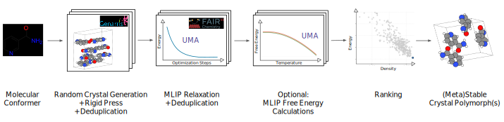

# FastCSP: Accelerated Molecular Crystal Structure Prediction with Universal Model for Atoms

FastCSP is a complete computational workflow for predicting molecular crystal structures from selected conformers by combining random structure generation and machine learning-based optimization without requiring high-accuracy DFT validation.

## Overview

FastCSP provides an end-to-end workflow for crystal structure prediction that scales from initial structure generation to experimental validation:

<div align="center">

</div>

### Workflow Stages

1. **Structure Generation**: [`Genarris 3.0`](https://github.com/Yi5817/Genarris) generates putative crystal structures.
2. **Deduplication**: Pymatgen's StructureMatcher deduplicates generated structures.
3. **ML Relaxation**: Structures are fully relaxed using the Universal Model for Atoms (UMA) from [`fairchem`](https://fair-chem.github.io/).
4. **Filtering & Deduplication**: Property filtering, structure deduplication using pymatgen's StructureMatcher and validation generates the energy landscape at 0 K.
5. **Experimental Validation** (Optional): Evaluation through comparison against experimental crystal structures using PackingSimilarity from CSD Python API [requires [CCDC license](https://downloads.ccdc.cam.ac.uk/documentation/API/installation_notes.html)] or pymatgen's StructureMatcher.
6. **Free Energy Calculations** (Optional): Free energy corrections are computed and a corrected energy landscape becomes available.

### Key Features

**High-Performance Computing Integration:**
- Native SLURM support for parallel processing across compute clusters
- Automatic job dependency management and fault tolerance
- Scalable from single molecules to large datasets

**Advanced Structure Analysis:**
- Multi-level structure comparison: pre/post-relaxation deduplication
- Configurable similarity metrics for crystallographic matching

**Flexible Workflow Control:**
- Modular stage-based execution - run complete pipeline or individual steps
- Resume capability - skip already completed stages
- Comprehensive logging system with restart capability

### Performance & Scalability

FastCSP is designed for production-scale crystal structure prediction campaigns:
- **Structure Generation**: 500+ structures per molecule within hour (depending on space group and Z complexity)
- **ML Relaxation**: tens of seconds per structure on modern GPUs
- **Structure Comparison**: Efficient parallel processing of large structure databases
- **Memory Usage**: Optimized for large datasets with batching
- **Storage**: Compressed Parquet format for efficient structure storage

## Output Directory Structure

FastCSP creates a well-organized directory structure to manage all data and results:

```
your_project_root/
├── FastCSP.log                     # Main workflow log file
├── molecules.csv                   # Input: Molecule definitions and conformer paths
├── config.yaml                     # Workflow configuration file
│
├── generated_structures/           # Stage 1: Raw Genarris structure generation
│   ├── MOLECULE1/
│   │   ├── CONFORMER1/
│   │   │   ├── Z1/
│   │   │   │    ├── ui.conf
│   │   │   │    ├── slurm.sh
│   │   │   │    ├── Genarris.out
│   │   │   │    └── structures.json
│   │   │   └── Z2/
│   │   └── CONFORMER2/
│   └── MOLECULE2/
│
├── raw_structures/                 # Stage 2: Processed and deduplicated structures
│   ├── MOLECULE1/
│   │   ├── CONFORMER1/
│   │   │   └── partition_id=*/
│   │   │       └── *.parquet      # Processed structures in Parquet format
│   │   └── CONFORMER2/
│   └── MOLECULE2/
│
└── relaxed/                        # Stage 3+: ML relaxation and analysis results
    └── uma_sm_1p1_omc_bfgs_0.01_1000_relaxcell/  # Named by ML model + optimizer settings
        ├── raw_structures/         # Stage 3: ML-relaxed crystal structures
        │   ├── MOLECULE1/
        │   │   └── CONFORMER1/
        │   │       └── partition_id=*/
        │   │           └── *.parquet  # Relaxed structures with energies
        │   └── MOLECULE2/
        │
        ├── filtered_structures/    # Stage 4: Energy-filtered and deduplicated structures
        │   ├── MOLECULE1.parquet   # One parquet per molecule
        │   └── MOLECULE2.parquet
        │
        └── matched_structures/         # Stage 5 (eval): name depends on method
            │                               #   csd      → matched_structures_csd/
            │                               #   pymatgen → matched_structures_pmg_l<ltol>_s<stol>_a<angle_tol>/
            ├── MOLECULE1.parquet           # Per-molecule structures with experimental similarity scores
            └── MOLECULE2.parquet
```

### Key Data Files

- **Parquet Files**: Compressed columnar storage containing structure data, energies, lattice parameters, and metadata
- **CIF Strings**: Stored within Parquet files for easy structure visualization and analysis
- **JSON Files**: Raw Genarris outputs with structure information
- **Log Files**: Comprehensive workflow logs with timestamps, stage progress, and error tracking

### Input File: molecules.csv

The `molecules.csv` file defines the target molecules for crystal structure prediction.

**Required Columns:**
| Column | Type | Description |
|--------|------|-------------|
| `name` | str | Unique identifier for the molecule (used as directory names) |
| `conformers_path` | str | Path to molecular geometry file (.xyz, .extxyz, .mol) or directory containing multiple conformers |

**Optional Columns:**
| Column | Type | Description | Example |
|--------|------|-------------|---------|
| `z` | str | List of Z-values (molecules per unit cell) | `"[1, 2, 4]"` |
| `spg` | str | Space group specification per Z-value | `"[[14, 19], [2, 4]]"` or `"standard"` |
| `refcode` | str | CSD refcode(s) for evaluation, comma-separated for polymorphs | `"ACSALA01,ACSALA02"` |
| `cif_path` | str | Path to experimental CIF file or directory for evaluation (alternative to global `evaluate.target_xtals_dir`) | `/data/experimental/aspirin.cif` |

**Example molecules.csv** (matches `core/configs/example_systems.csv`):
```csv
name,conformers_path,refcode
ACETAC,ACETAC03_mol.xyz,ACETAC
GLYCIN,GLYCIN20_mol.xyz,"GLYCIN20,GLYCIN32,GLYCIN68,GLYCIN16,GLYCIN67"
IHEPUG,IHEPUG_mol.xyz,"IHEPUG02,IHEPUG"
```

**Space Group (`spg`) Behavior:**
| `spg` value | `z` value | Result |
|-------------|-----------|--------|
| `"standard"` | `[1, 2, 4]` | All compatible space groups used for each Z |
| `[14, 19]` | `[1, 2, 4]` | Space groups 14 and 19 used for **all** Z values |
| `[[14, 19], [2, 4], [14]]` | `[1, 2, 4]` | SG 14,19 for Z=1; SG 2,4 for Z=2; SG 14 for Z=4 |

**Notes:**
- Enable `read_z_from_file: true` and/or `read_spg_from_file: true` under `genarris.vars` in the config to use per-molecule `z`/`spg` values from the CSV
- `conformers_path` can point to a single geometry file (.xyz, .extxyz, .mol) or a directory containing multiple conformer files
- For evaluation, supply experimental crystals via either `evaluate.target_xtals_dir` (one shared directory of `.cif` files keyed by refcode) or a per-molecule `cif_path` column
- `refcode` can be comma-separated for polymorphs

## Getting Started

### Prerequisites
- SLURM cluster environment for parallel processing
- GPU resources for efficient ML relaxations

### Installation
1. Clone the [fairchem repo](https://github.com/facebookresearch/fairchem/tree/main)
2. Install FastCSP: `pip install -e packages/fairchem-applications-fastcsp`

### External Dependencies
- **(Required)** [`Genarris 3.0`](https://github.com/Yi5817/Genarris): Crystal structure generation engine
- **(Optional)** [`CSD Python API`](https://downloads.ccdc.cam.ac.uk/documentation/API/installation_notes.html): For experimental structure comparison (requires license)

### Basic Usage

**Complete Workflow:**
```bash
# Run full crystal structure prediction pipeline
fastcsp --config config.yaml --stages generate process_generated relax filter
```

**Stage-by-Stage Execution:**
```bash
# Generate structures only
fastcsp --config config.yaml --stages generate

# Run relaxation and filtering
fastcsp --config config.yaml --stages relax filter

# Evaluate against experimental data
fastcsp --config config.yaml --stages evaluate
```

**Restart Capability:**
```bash
# FastCSP automatically detects completed stages and resumes from the last incomplete stage
fastcsp --config config.yaml --stages generate process_generated relax filter
```

### Available Workflow Stages

| Stage | Description | Output |
|-------|-------------|--------|
| `generate` | Generate crystal structures using Genarris | `generated_structures/` |
| `process_generated` | Process and deduplicate Genarris outputs | `raw_structures/` |
| `relax` | Perform UMA-based structure relaxation | `relaxed/<run_name>/raw_structures/` |
| `filter` | Property filtering and duplicate removal | `relaxed/<run_name>/filtered_structures/` |
| `evaluate` | Compare against experimental data | `relaxed/<run_name>/matched_structures_{csd,pmg_*}/` |
| `compute_free_energy` *(optional)* | Quasi-harmonic vibrational free energies | `relaxed/<run_name>/free_energy/` |

### Configuration

FastCSP uses YAML configuration files to control all workflow parameters. Example configurations can be found in `core/configs/example_config.yaml`.

**Key Configuration Sections:**
- `root`: Base directory for all outputs
- `molecules`: Path to input molecule CSV file (required columns `name`,
  `conformers_path`; optional `z`, `spg`, `refcode`, `cif_path`)
- `genarris`: Structure generation parameters
  (`mpi_launcher`, `python_cmd`, `genarris_cli`, `genarris_base_config`,
  `vars.{Z, spg_distribution_type, num_structures_per_spg, read_z_from_file,
  read_spg_from_file}`) and SLURM block
- `pre_relaxation_filter`: Pre-ML deduplication
  (`assign_groups`, `remove_duplicates`, `remove_problematic`, `ltol`/`stol`/`angle_tol`,
  `bin_by_conf`/`bin_by_z`/`bin_by_spg`, `density_bin_size`, `density_tol`,
  `apply_niggli_filter`, `npartitions`). Set `remove_problematic: true` to drop structures whose
  generation-time validity flags (`correct_z`, `molecule_matches_reference`) are False before
  relaxation.
- `relax`: ML relaxation settings
  (`calculator`, `optimizer`, `fmax`, `max_steps`, `fix_symmetry`,
  `relax_cell`, `write_traj`, `traj_interval`) and SLURM block
- `post_relaxation_filter`: Property cutoffs and deduplication
  (`remove_problematic`, `energy_cutoff`, `density_min_cutoff`,
  `density_max_cutoff`, `assign_groups`, `remove_duplicates`,
  `ltol`/`stol`/`angle_tol`,
  `bin_by_conf`/`bin_by_z`/`bin_by_spg`, `density_bin_size`/`energy_bin_size`,
  `density_tol`/`energy_tol`, `apply_niggli_filter`)
- `evaluate`: Experimental comparison
  (`method` = `csd` or `pymatgen`, `target_xtals_dir`,
  `csd.{num_cpus, python_cmd, target_rows_per_chunk, chunk_timeout}`,
  `pymatgen.{match_params, slurm}`)
- `free_energy`: Vibrational free energy corrections (run with
  `--stages compute_free_energy`). Keys: `calculator`, `quasiharmonic`,
  `atom_disp`, `min_lengths`, `t_min`/`t_max`/`t_step`, `match_only`,
  `energy_cutoff`, `max_structures`, `structures_per_job`, `compute_dos`,
  and a `slurm` block.
- `logging`: Log file settings (`level`, `console`)

> See [`core/configs/example_config.yaml`](core/configs/example_config.yaml)
> for the exhaustive, commented reference. Note: enabling
> `apply_niggli_filter=true` outside a `(mol_id, Z, spg)` bucket emits a
> runtime warning - the prefilter is most reliable when both `bin_by_z` and
> `bin_by_spg` are also `true`.

### Monitoring Progress

FastCSP provides comprehensive logging and progress tracking:

```bash
# Monitor workflow progress
tail -f your_project_root/FastCSP.log

# Check SLURM job status
squeue -u $USER

# View stage completion in log
grep "STAGE COMPLETE" your_project_root/FastCSP.log
```

## Citation

If you use FastCSP in your research, please cite:

```bibtex
@misc{gharakhanyan2025fastcsp,
  title={FastCSP: Accelerated Molecular Crystal Structure Prediction with Universal Model for Atoms},
  author={Gharakhanyan, Vahe and Yang, Yi and Barroso-Luque, Luis and Shuaibi, Muhammed and Levine, Daniel S and Michel, Kyle and Bernat, Viachaslau and Dzamba, Misko and Fu, Xiang and Gao, Meng and others},
  year={2025},
  eprint={2508.02641},
  archivePrefix={arXiv},
  primaryClass={physics.chem-ph},
  url={https://arxiv.org/abs/2508.02641},
}
```

## Support & Contribution

- **Issues**: [GitHub Issues](https://github.com/facebookresearch/fairchem/issues)
- **Discussions**: [GitHub Discussions](https://github.com/facebookresearch/fairchem/discussions)
